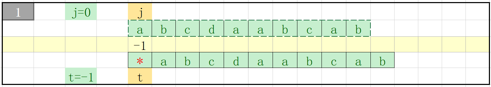
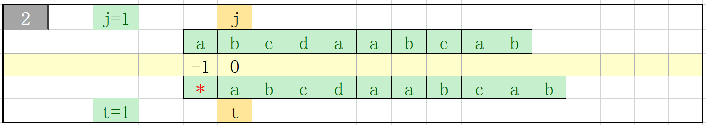
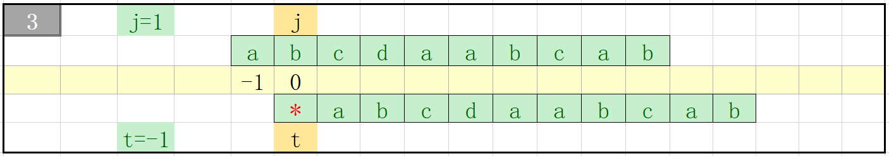
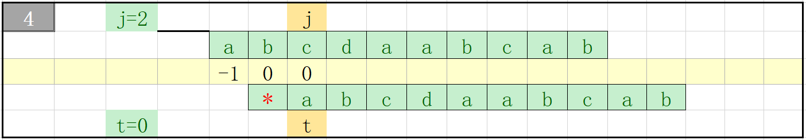
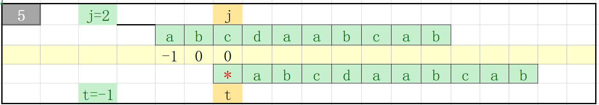
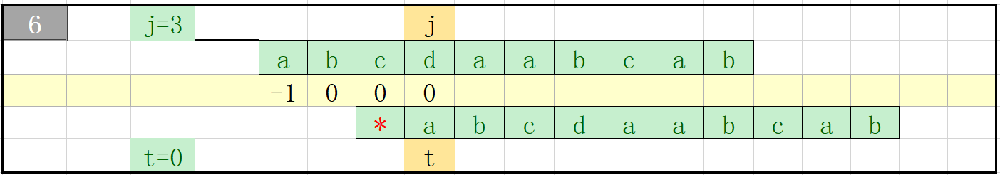
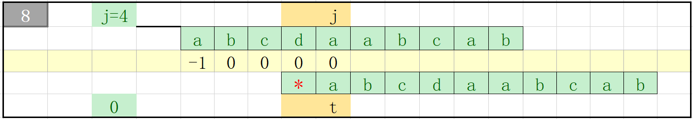
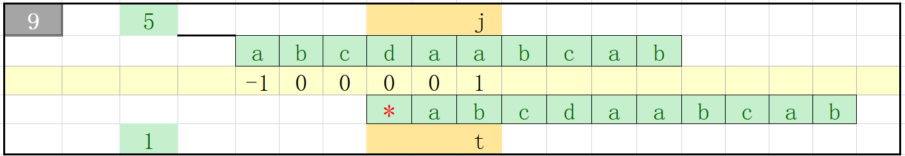
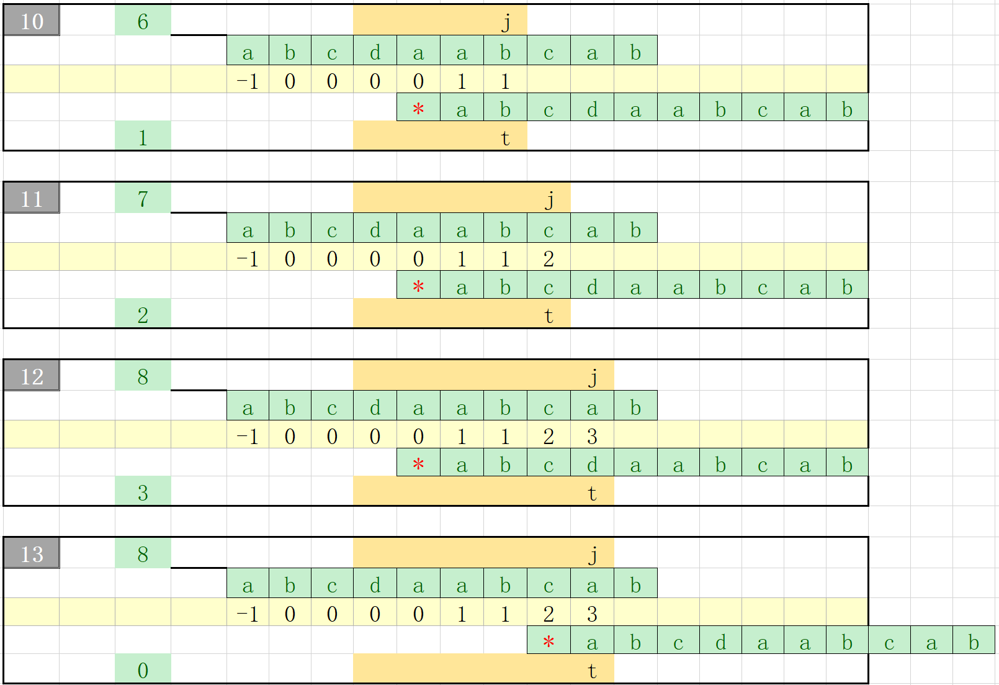
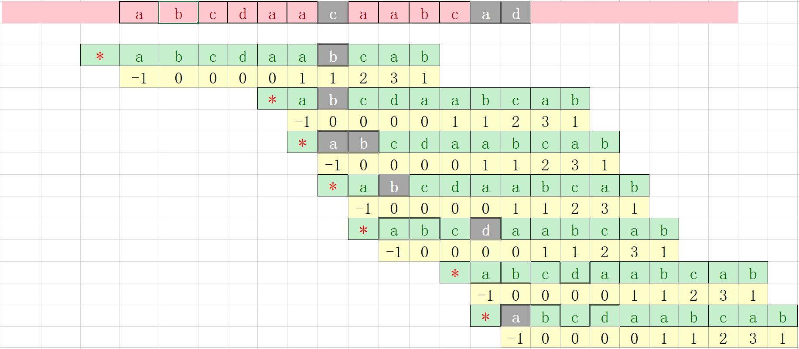

## KMP图解

### Build search table

pattern: a	b	c	d	a	a	b	c	a	b













- implementation in c++
``` c++
vector<int> buildSearchTable(const string& needle)
{
    vector<int> searchTable{};
    searchTable.resize(needle.size());
    searchTable[0] = -1;
    int t = -1;
    size_t j = 0;

    while(j < needle.size()-1)
    {
        if(t < 0 || needle[j] == needle[t])//注意t < 0 这个条件
        {
            searchTable[++j] = ++t;
        }
        else
        {
            t = searchTable[t];
        }
    }
    return searchTable;
}
```


### search for the pattern
a	b	c	d	a	a	c	a	a	b	c	a	d

